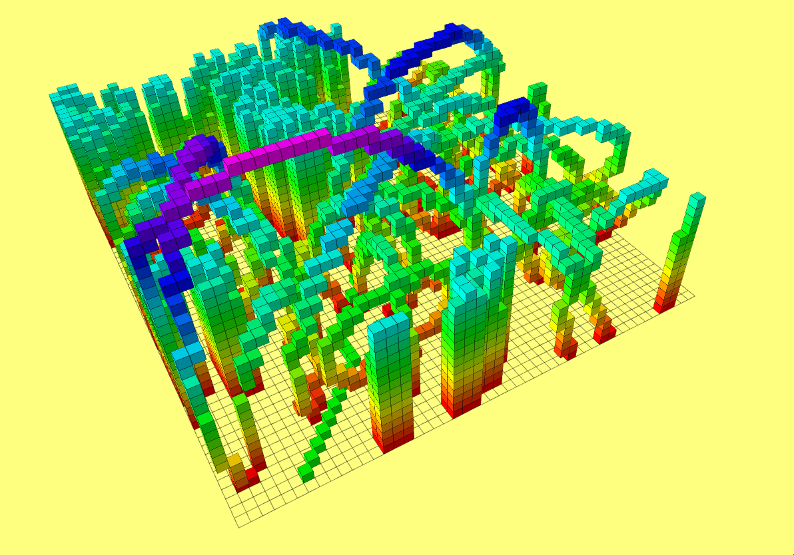
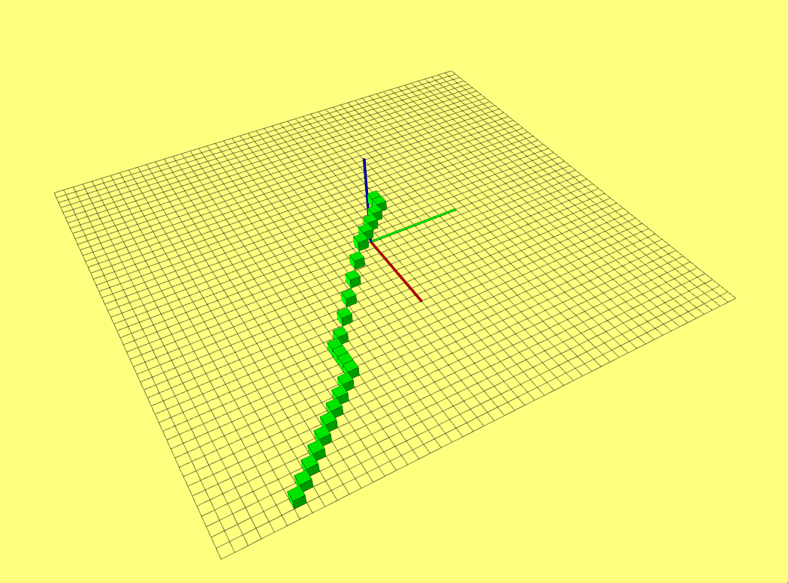
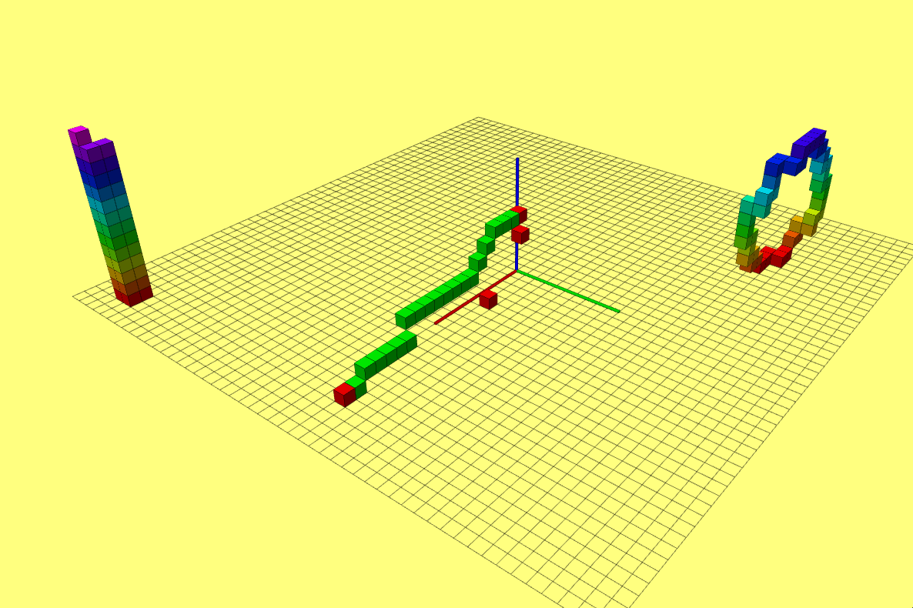

### 1 代码位置[here](./grid_path_searcher)
---
### 2 算法流程
&emsp;&emsp;老师讲的蛮详细的，我这里就是简单翻译
* 1. 维护优先级列表存储所有扩展节点
* 2. 计算n的触发函数h(n)
* 3. 在初始时候讲开始节点加入优先级队列X~s~
* 4. 初始节点的g(X~s~)为0,其他节点g(n)为inf
* 5. 循环
  * (1) 如队列为空，退出循环
  * (2) f(n) = g(n)+h(n) 选择最小的f(n)的key,从队列中删除
  * (3) 讲n节点作为扩展过的节点
  * (4) 如果n节点是目标节点，返回成功，退出循环
  * (5) 寻找n节点未扩展节点m
    * if g(m) == inf 未加入过队列
       * g(m) = g(n)+C<sub>nm</sub> g(m)为g(n)加上nm之间代价
       * 将m节点加入队列
    * if g(m) > g(n)+C<sub>nm</sub> 当g(m)加入过队列，m节点代价小于从当前n点出发的代价
       * g(m) = g(n)+C<sub>nm</sub> g(m)更新为g(n)加上nm之间代价
       * 这里补充下，需要更新队列key值，当然跟选择队列容器有关
  * 结束,开始下个循环
* 结束循环

### 3 运行结果
运行效果  
  
去除障碍物效果  

---
### 4 对比不同启发函数
&emsp;&emsp; 考虑调用同一个点，对比效果,但也受到地图环境变换生成的影响,故通过topic修改计算h的方法.
```
_method_set = nh.subscribe("method_set", 1, rcvSetMethod);
```
```
  double D1 = 1;
  double D2 = sqrt(2);
  double D3 = sqrt(3);
  double dx = fabs(node1->index(0) - node2->index(0));
  double dy = fabs(node1->index(1) - node2->index(1));
  double dz = fabs(node1->index(2) - node2->index(2));
  double distance = 0;
  if (hmethod == 1) {
    double _Euclidean = (dx) * (dx) + (dy) * (dy) + (dz) * (dz);
    distance = sqrt(_Euclidean);
  } else if (hmethod == 2) {
    distance = dx + dy + dz;

  } else if (hmethod == 3) {
    double Diagonal_tmpMax = max(dx, dy);
    Diagonal_tmpMax = max(Diagonal_tmpMax, dz);

    double Diagonal_tmpMin = min(dx, dy);
    Diagonal_tmpMin = min(Diagonal_tmpMin, dz);

    double Diagonal_tmpMid = dx + dy + dz - Diagonal_tmpMax - Diagonal_tmpMin;
    distance = (D3 - D2) * Diagonal_tmpMin + (D2 - D1) * Diagonal_tmpMid +
               D1 * Diagonal_tmpMax;
  }
```
```
rostopic pub /goal geometry_msgs/PoseStamped "header:
  seq: 0
  stamp:
    secs: 0
    nsecs: 0
  frame_id: ''
pose:
  position:
    x: 4.5936794281
    y: -4.07747602463
    z: 0.0
  orientation:
    x: 0.0
    y: 0.0
    z: 0.0
    w: 0.0"
```
|               | Manhattan | Euclidean | Diagonal |
| ------------- | :-------: | --------: | -------: |
| Time          | 0.405120  | 43.060040 | 9.053896 |
| visited_nodes |    34     |      1650 |      512 |

从测试结果分析Manhattan的H函数最优，其次是Diagonal，Euclidean最差。
### 5 Tie Breaker
&emsp;&emsp; 同样，添加tie修改topic.
```
 _tie_set = nh.subscribe("tie_set", 1, rcvSetTie);
```
```
if (ifTie)
    distance = distance * (1 + 000.1);
```
before
|               | Manhattan | Euclidean |  Diagonal |
| ------------- | :-------: | --------: | --------: |
| Time          | 0.400206  | 35.397524 | 10.672167 |
| visited_nodes |    28     |      1397 |       493 |
---
after
|               | Manhattan | Euclidean | Diagonal |
| ------------- | :-------: | --------: | -------: |
| Time          | 0.339725  | 21.861671 | 0.405558 |
| visited_nodes |    28     |       461 |       27 |

从测试结果，使用tie breaker后，效率提高了20~30倍。使用Manhattan距离优化较少，考虑地图环境不够复杂，当地图环境复杂后，应该会有提升。
### 6 遇到的问题
&emsp;&emsp;主要是原始代码的变量含义比较模糊，如edgeCostSets，多次猜测验证后，才确认含义。另外个人觉得mutilmap做优化队列太过复杂，不过应该也是最简单的。
### 7 JPS实现
&emsp;&emsp;与A^*^  实现类似。  
A^*^  
|               | Manhattan | Euclidean | Diagonal |
| ------------- | :-------: | --------: | -------: |
| Time          | 0.340099  | 38.762372 | 6.569357 |
| visited_nodes |    27     |      1126 |      296 |
---
JPS
|               | Manhattan | Euclidean | Diagonal |
| ------------- | :-------: | --------: | -------: |
| Time          | 3.908311  |  2.419027 | 3.759877 |
| visited_nodes |    584    |       584 |      584 |

&emsp;&emsp; 从测试结果看JPS的数据Manhattan测试结果仍是最优，除Manhattan外，时间效率提高了1倍到19倍。因JPS每个点搜索dir方向上的相邻点，及forced point,所以搜索效率提高。

---
在极致空旷的环境下 

|               | A^*^_Euclidean |      JPS |
| ------------- | -------------: | -------: |
| Time          |       4.918582 | 6.135275 |
| visited_nodes |            400 |        7 |
&emsp;&emsp; JPS访问点少2个数量级，但是生成任务时间大于A^*^。