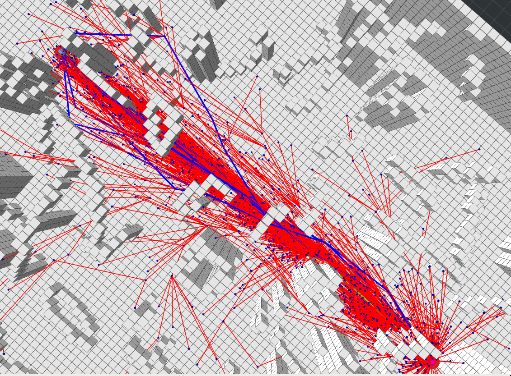

### 1 ChooseParent [实现](./path_finder/include/path_finder/rrt_star.h#L300)
### 2 Rewire[实现](./path_finder/include/path_finder/rrt_star.h#L363)
### 3 infomed 如下：
[getInformedInfo](./path_finder/include/path_finder/rrt_star.h#L201)
[产生采样点](./path_finder/include/path_finder/rrt_star.h#L236)
[单位圆采样](./path_finder/include/path_finder/sampler.h#L54)
运行效果
