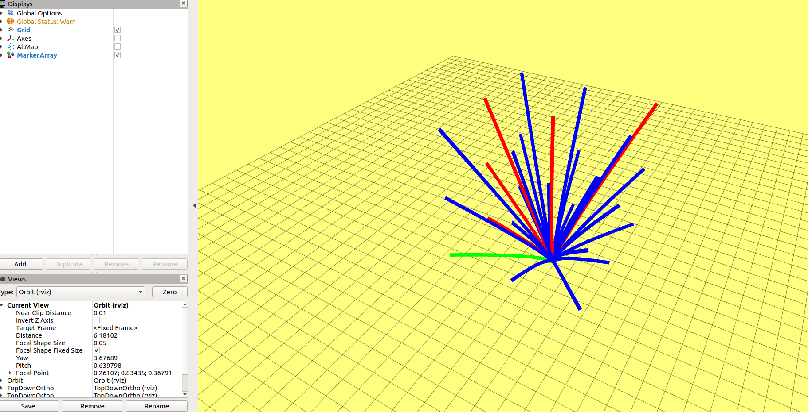
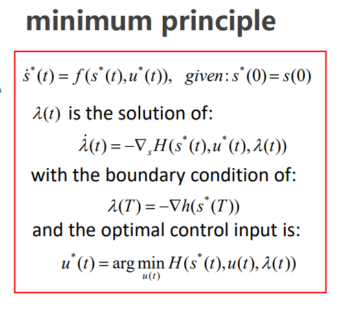
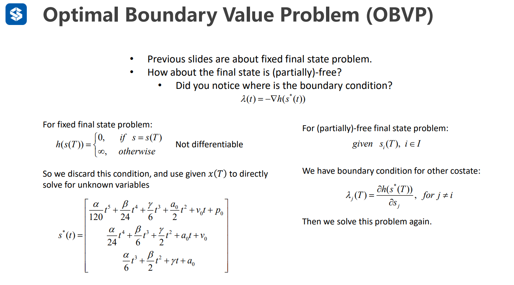
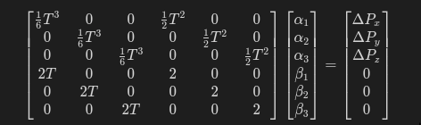

### STEP1
[here](./grid_path_searcher/src/demo_node.cpp#L162)
### STEP2
使用sympy简化J及计算J的导数[here](./grid_path_searcher/script/polynomial_function_test.py)  
演算结果:

J导数求根及J值计算[here](./grid_path_searcher/src/hw_tool.cpp#L105)  
效果如下

### 个人一些总结
关于如果P给定，V不给定情况  
  

按照公式  
$$\lambda_j=\frac{\partial h(S^*(T))}{\partial S_j},    for j!=i$$ 

所以对于V来说$\lambda(T)=0$就是偏导的极值,即代码推到中的c)中关于V的部分为0。公式就修改为  
$$\begin{bmatrix}
\frac{1}{6}T^3 & 0  & 0& \frac{1}{2}T^2 &  0 &  0\\
 0& \frac{1}{6}T^3  & 0& 0 & \frac{1}{2}T^2  &  0\\
 0& 0 & \frac{1}{6}T^3 & 0 &  0 &  \frac{1}{2}T^2\\
 2T & 0  & 0& 2 &  0 &  0\\
 0& 2T & 0& 0 & 2  &  0\\
 0& 0 & 2T & 0 &  0 &  2
\end{bmatrix}\begin{bmatrix}
\alpha_1 \\
\alpha_2 \\
\alpha_3 \\
\beta_1 \\
\beta_2 \\
\beta_3 
\end{bmatrix}=\begin{bmatrix}
\Delta P_x \\
\Delta P_y \\
\Delta P_z \\
0 \\
0 \\
0
\end{bmatrix}$$  
因公式编辑有不同md解析有不用情况,故截图  
  
然后求解$\alpha,\beta$,看在码了这么久公式份上，如果理解有误，请及时指正。
