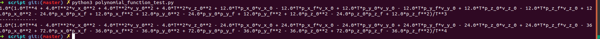

### STEP1
[here](./grid_path_searcher/src/demo_node.cpp#L162)
### STEP2
使用sympy简化J及计算J的导数[here](./grid_path_searcher/script/polynomial_function_test.py)  
演算结果:

J导数求根及J值计算[here](./grid_path_searcher/src/hw_tool.cpp#L105)  
效果如下
