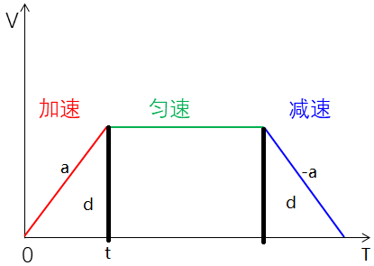
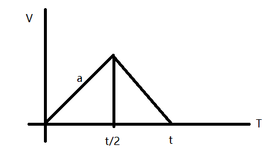

### BIVP
代码位置[here](lec5_hw/src/click_gen.cpp#L74)  
步骤:  
* 1.初始化F0,及初始位置，速度，加速度
* 2.循环初始化Ei,Fi。确保必须过某个航点，且在航点上速度，加速度，jerk,sanp连续性，即求导为0    
* 3.初始化Em点,及末尾的位置，速度，加速度
* 4.求逆
  
图片效果  

视频效果  

### 梯形速度曲线解读
汪博代码中的位置[here](lec5_hw/src/click_gen.cpp#L37)  
  
加速和减速的斜率为a,梯形面积为距离dist  
代码中的t是加速到匀速的时间,d为到t的面积  
* 1 如果距离小于2d,证明没有达到匀速阶段，就开始减速，为等腰三角形  
  
dist = (1/2)\*t\*(a*t/2)  
t = 2\*sqrt(dist/a)
* 2 否则就是梯形。则dist-2\*d是中间矩形的面积，在除以vel(需要保持的匀速),为矩形的底(即中间矩形时间)，再加左右2侧时间，为总时间