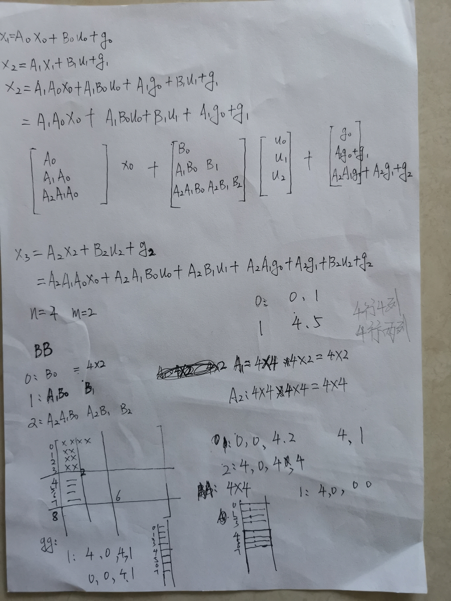
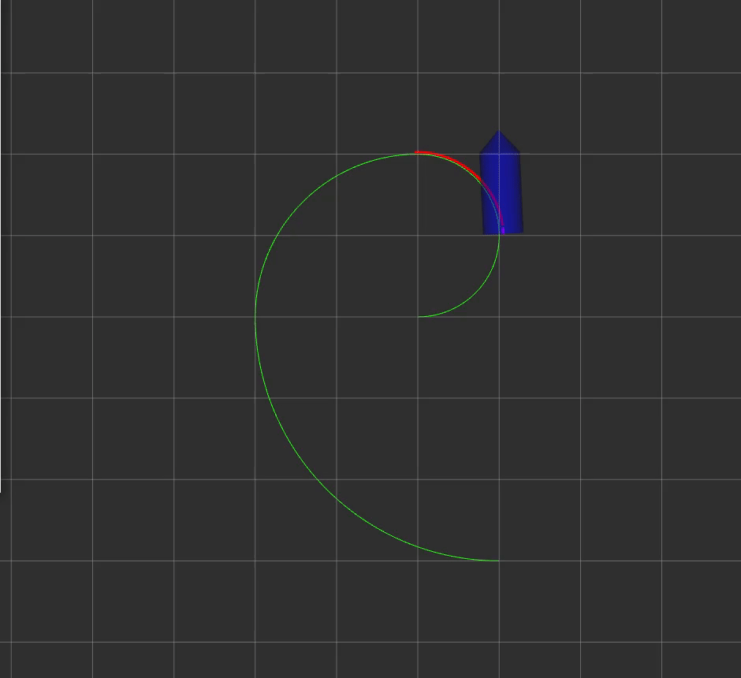

### 功能实现
1.边界设置[here](mpc_car/include/mpc_car/mpc_car.hpp#L197)   
2.BB AA[here](mpc_car/include/mpc_car/mpc_car.hpp#L276)   
3.qx [here](mpc_car/include/mpc_car/mpc_car.hpp#L298)   
4.compensateDelay[here](mpc_car/include/mpc_car/mpc_car.hpp#L128)
5.一些推导   

### 效果如下
